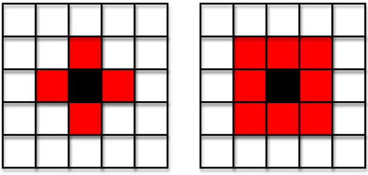
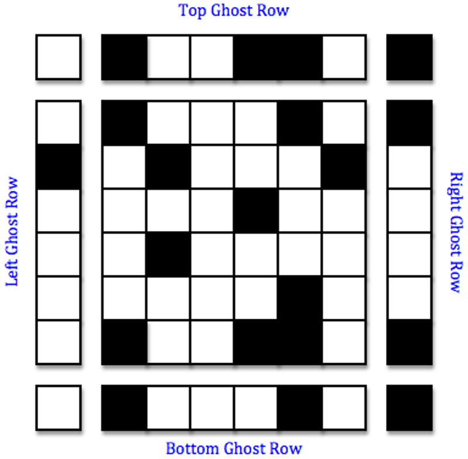
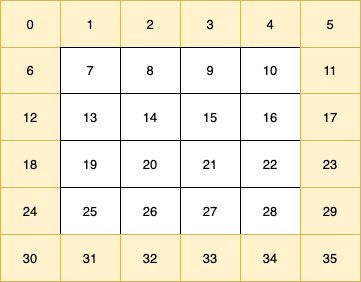
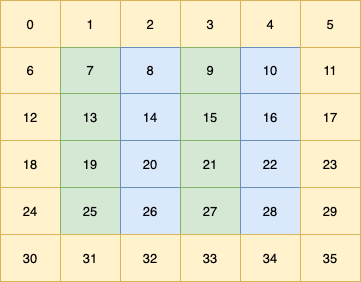

# Parallelizing the Game of Life with OpenMP

Libby Shoop,  Macalester College

Small parts of this activity were originally written by Aaron Weeden, Shodor Education Foundation, Inc. and adapted with permission by the author.

This is an activity with working OpenMP code to demonstrate how to use OpenMP pragmas and random number generator libraries with nested loops over flattened arrays for structured grid simulations. Features:
- An example of a parallel computational pattern called a **structured grid**, which uses a stencil and features multiple iterations over that grid using a "double buffereing" technique.
- C++ code using two different random number generation  libraries:
	- the C++ `random` library
	- the `trng` library (requires an install)
- Animations and graphical displays, but requires gnuplot installed on linux
	- Text display and result files can be generated also, so this is useful even if you don't have linux and gnuplot available.
- 2D arrays stored as flattened 1D arrays (a common way to work with 2D in HPC simulations)
- Introduces using profiling tool, gprof, as a way to determine where time is spent in the application
- A parallel example where scalability can be observed

### Prerequisites

- Some practice using parallel for loops in OpenMP (see [Chapter 2 of the Intermediate PDC](https://www.learnpdc.org/IntermediatePDC/2-SharedMemoryPatternlets/toctree.html) online textbook)
- Practice with random number libraries such as the C++ random library or the parallel `trng` library (see [Chapter 3 of the Intermediate PDC](https://www.learnpdc.org/IntermediatePDC/3-RandomPatterns/toctree.html) online textbook)
- Some instruction or activity for strong and weak scalability and depicting it with graphs. This repository provides such an activity, including how to use a pre-formatted Google sheet to graph strong and weak scalability: https://github.com/csinparallel/CSinParallel/tree/main/Exemplars/TrapezoidIntegrationScaling 
### Introduction to the application
We will study some well-organized code that contains a sequential and parallel implementation of Conway's classic Game of Life [15] and a variation that introduces probability to its rules. The Game of life is in the class of applications known as *cellular automata*.

The cellular automaton is an important tool in science that can be used to model a variety of natural phenomena. Cellular automata can be used to simulate brain tumor growth by generating a 3-dimensional map of the brain and advancing cellular growth over time [1]. In ecology, cellular automata can be used to model the interactions of species competing for environmental resources [2]. These are just two examples of the many applications of cellular automata in many fields of science over the years, including biology [3][4], ecology [5], cognitive science [6], hydrodynamics [7], dermatology [8], chemistry [9],  [10] environmental science [11], agriculture [12], operational research [13], and many others. Indeed, up to this day cellular automata are still being studied and adapted to simulate scientific phenomenon, including a recent study that added stochastic behavior to the Game of Life to better simulate population genetics [16].

Cellular automata are so named because they perform functions automatically on a grid of individual units called cells. These types of algorithms make up the computational pattern called *Structured Grids* along the left side of the parallel patterns diagram supplied for this course and found in Chapter 1 of the Intermediate PDC textbook https://www.learnpdc.org/IntermediatePDC/1-PDCPatterns/PatternsIntro.html). Another hallmark of these computations is that computations are performed in a series of steps, or iterations, where in each step the cells are updated based on the state of the neighborhood of cells around them. The neighborhood of cells used is called a **stencil**, and can vary between and within applications.

**TO DO:**

1. Find Structured Grid on the parallel patterns diagram along the left as a computational pattern. This type of code that you are studying here is well used in scientific programming and can have very good parallel solutions.
2. In the link to the [Berkeley patterns page](https://patterns.eecs.berkeley.edu/?page_id=498), find the definition of a stencil. Note how this is applied in the code as it is described later below.
3. In that same [Berkeley patterns page](https://patterns.eecs.berkeley.edu/?page_id=498), read about the technique called *double buffering*. As you study the code from this activity, try to find where the double buffering technique is used.

One of the most significant and important examples of the cellular automaton is John Conway's Game of Life, which first appeared in [15]. Conway wanted to design his automaton such that emergent behavior would occur, in which patterns that are created initially grow and evolve into other, usually unexpected, patterns. He also wanted to ensure that individual patterns within the automaton could dissipate, stabilize, or oscillate. Conway's automaton is capable of producing patterns that can move across the grid (gliders or spaceships), oscillate in place (flip-flops), stand motionless on the grid (still lifes), and generate other patterns (guns).

Conway established four simple rules that describe the behavior of cells in the grid. At each time step, every cell in the grid has one of two particular states: ALIVE or DEAD. The rules of the automaton govern what the state of a cell will be in the next time step.

Like all cellular automata, the rules in Conway's Game of Life pertain to cells and their "neighbors", or the cells to which a cell is somehow related (usually spatially). The collection of a cell's neighbors is known as the cell's "neighborhood". Two examples of neighborhoods are shown in Figure 1. The code in this module uses the latter of these two, the "Moore neighborhood", in which the 8 cells immediately adjacent to a cell constitute the cell's neighbors.




**Figure 1: Two types of neighborhoods of a black cell, consisting of red neighbor cells: von Neumann neighborhood (left) and Moore neighborhood (right).**

An issue arises for the cells on the edges of the grid, since they will not have a full neighborhood. Cells on the sides only have 5 neighbors, and those in the corners only have 3 neighbors. There are numerous ways to solve this problem. In this module, we resolve the issue by modeling the grid not as a rectangle, but as a torus that wraps around on the top, bottom, and sides. In this arrangement, the cells in the top row have the cells in the bottom row as their neighbors to the north, the cells in the bottom row have those in the top row as their neighbors to the south, the cells in the left column have the cells in the right column as their neighbors to the west, and the cells in the right column have the cells in the left column as their neighbors to the east. A toroidal grid can be simplified by including "ghost" rows and columns, which are copies of the rows and columns on the opposite sides of the grid from the edge rows and columns. A ghost corner is determined by copying the corner cell that is opposite the ghost corner on the diagonal. The method of using ghost rows and columns is depicted in Figure 2.



**Figure 2: A toroidal grid simplified with ghost rows and columns**

## The Rules

The rules of Conway's Game of Life are as follows:

- If a cell has fewer than 2 ALIVE neighbors, it will be DEAD in the next time step.
- If an ALIVE cell has 2 or 3 ALIVE neighbors, it will be ALIVE in the next time step.
- If a cell has more than 3 ALIVE neighbors, it will be DEAD in the next time step.
- If a DEAD cell has 3 ALIVE neighbors, it will be ALIVE in the next time step.

The automaton begins by initializing the states of the cells randomly and ends after a certain number of 'time steps', or iterations  have elapsed.

### Directory and File structure

This code is highly decomposed so that each file is small and devoted to a specific purpose. This should make it easier to concentrate on a specific part of the code as you add changes.

The directories in this repository are as follows:

| Directory             | Purpose                                                                                                                          |
| --------------------- | -------------------------------------------------------------------------------------------------------------------------------- |
| ./command_line/       | Code for command line argument handling                                                                                          |
| ./docs_images/        | Images used in this README doc                                                                                                   |
| ./graphics/           | Code for displaying graphical image of grid (uses gnuplot)                                                                       |
| ./grid_omp_rand_cpp/  | OpenMP version of the grid functions that you will work on if you are using C++ random numbers                                   |
| ./grid_omp_rand_trng/ | OpenMP version of the grid functions that you will work on if you are using the trng random number library (requires an install) |
| ./grid_seq_rand_cpp/  | Sequential version of the grid functions if you are using C++ random numbers- DO NOT CHANGE (for reference)                      |
| ./grid_seq_rand_trng/ | Sequential version of the grid functions if you are using the trng random number library                                         |
| ./movie_images/       | This is where images will be stored that can be used to create an mpeg movie                                                     |
| ./object_files/       | This is where the code in the commandline and graphics folders gets compiled into object files                                   |
Here is an explanation of the code files within the above directories and in this directory:

| Code File                                   | Description                                                                                                             |
| ------------------------------------------- | ----------------------------------------------------------------------------------------------------------------------- |
| command_line/getCommandLine.cpp             | Handle command line argument flags                                                                                      |
| grid_omp_rand_cpp/cpprandom_calcNewGrid.cpp | OpenMP function called each iteration using C++ random library when in STOCHASTIC mode                                  |
| grid_omp_rand_cpp/cpprandom_initGrid.cpp    | OpenMP function called once to initialize the grid with random alive cells using C++ random library                     |
| grid_omp_rand_trng/trng_calcNewGrid.cpp     | OpenMP function called each iteration using trng random library when in STOCHASTIC mode                                 |
| grid_omp_rand_trng/trng_initGrid.cpp        | OpenMP function called once to initialize the grid with random alive cells (exercise is to use trng random library)     |
| grid_seq_rand_cpp/cpprandom_calcNewGrid.cpp | Sequential function called each iteration using C++ random library when in STOCHASTIC mode                              |
| grid_seq_rand_cpp/cpprandom_initGrid.cpp    | Sequential function called once to initialize the grid with random alive cells using C++ random library                 |
| grid_seq_rand_trng/trng_calcNewGrid.cpp     | Sequential function called each iteration using trng random library when in STOCHASTIC mode                             |
| grid_seq_rand_trng/trng_initGrid.cpp        | Sequential function called once to initialize the grid with random alive cells (exercise is to use trng random library) |
| grid_common.cpp                             | Functions printGrid and prdat used in all  versions of the program                                                      |
| gol_omp.cpp                                 | OpenMP version containing main() that you will study carefully                                                          |
| gol_rules.cpp                               | The apply_rules function that encodes the rules described above                                                         |
| gol_seq.cpp                                 | Sequential version containing main() to use for reference.                                                              |

### The executables

Please look at the Makefile to see the following lines:

```
# These use randomness when creating a starting grid
PROGS = cpprand_gol_omp cpprand_gol_seq cpprand_gol_seq_prof

# Initially, these do not use trng- it's an excresise to add it
PROGS_TRNG = trng_gol_omp trng_gol_seq

# These use randomness when deciding on the hardiness of a live cell
STOCHASTIC_PROGS = cpprand_stgol_omp
STOCHASTIC_PROGS_TRNG = trng_stgol_omp

all: $(PROGS) $(STOCHASTIC_PROGS) $(PROGS_TRNG) $(STOCHASTIC_PROGS_TRNG)
```

The PROGS are executables that will build using the files devoted to the C++ random library listed above. The  PROGS_TRNG are the executables that will build using the files given for the trng random number library listed above.


 If you do not have the trng random number generation library installed on the machine where you are building this code, you will need to comment out the trng-based executables in the 'all' line like this:

```
all: $(PROGS) $(STOCHASTIC_PROGS) #$(PROGS_TRNG) $(STOCHASTIC_PROGS_TRNG)
```

### A twist to the classic rules
In paper [16] listed below, the authors added probability to the classic game of life rules, creating versions that are referred to as **stochastic**. This enabled them to realistically model the dynamics in a population of real organisms. We introduce versions of the code that implement part of their additions. This is what the STOCHASTIC_PROGS that get built are. We describe this implementation below.
### Using the sequential version to see how it works and profile

The Makefile should build all versions by simply typing

		make

We'll start by working with the sequential version to see how the program works and what the purpose of the various command-line arguments is. We will use the sequential version that uses the C++ random number library, since you should have that installed on your machine. First try this to see what the command line arguments are:

```
./cpprand_gol_seq -h
```

The results are this 'usage' text:

```
Usage: ./cpprand_gol_seq [-m dim] [-i iterations] [-t numThreads] [-d] [-v] [-a]
  -w dim         : width of the grid (default: 2048)
  -l dim         : vertical length of the grid (default: 2048)
  -i iterations  : number of iterations (default: 1024)
  -t numThreads  : number of threads to use (default: 1)
  -d             : debug mode (default: off)
  -g             : graphics mode for depicting grids (default: off)
  -a             : enable animation (default: off)
  -m             : create movie images (default: off)
  -c             : center initialization of glider pattern (default: off)
  -h             : display this help message
```

In the case of the sequential version, we've forced the number of threads to be 1; the -t option only applies to the OpenMP version that we will study.

The -d option is used to test whether the results are the same when repeated. In this 'debug' mode, the random number generator is initiated with a fixed seed. You can find this near line 76 of the file `gol_seq.cpp`.

The -c option is also used for debugging: it creates an interesting starting pattern  of live cells called a *glider* that moves across the screen in each iteration.

The -g, -a, and -m options require the linux plotting package called gnuplot to be installed. The motion mentioned above for the glider can only been seen if you have gnuplot available, as well as any other visualization of the game at each iteration.

If you do not have gnuplot installed on your machine, you can still see a small example by using a grid size of less than or equal to 10x10, like this:
```
./cpprand_gol_seq -i 3 -w 8 -l 8 -d -c
```

When testing small grids, it is necessary to use the glider pattern because other initial random grad patterns will die out too quickly. This is the reason we used the -c above.

There is another debugging tool built into this code, which is this line that prints out at the end:

		Total: 5

This is the total number of live cells at the end of the simulation. You can also use this whe you try larger cases, even if you don't have the gnuplot graphics available.

The above is the sequential version. In this case we are not using random numbers at all because we chose the glider pattern to initialize the grid. You can run the OpenMp version with 1 and 2 threads to see that it is working correctly in terms of the OpenMP pragmas found in the file `grid_omp_rand_cpp/cpprandom_calcNewGrid.cpp`. Have a look at this file now to see the OpenMP pragma used on the nested loop over the 2D grid. Here's a series of test you can do to check that the results are the same except for the time taken and the number of threads used for each one:
```
./cpprand_gol_omp -i 3 -w 8 -l 8 -d -c -t 1 >tmpp1
./cpprand_gol_omp -i 3 -w 8 -l 8 -d -c -t 2 >tmpp2
diff tmpp1 tmpp2
```

As we study the parallel implementations, we can always use the technique shown above, or we can also look directly at the output files that get printed in debug mode: `initial.dat` and `final.dat`. These contain the state of the grid at the beginning and end of the simulation.

### Graphics and animation (requires gnuplot)
If you have a machine that has gnuplot and a way of displaying X11 output remotely, you can run these examples.

To see the glider in action try this:
```
./cpprand_gol_seq -i 50 -w 20 -l 20 -a -c
```
Note that we have used the -a flag for animation and the -c flag to start with the glider pattern. 

There is a movie file of this animation in `docs_images/glider.mp4` [here](https://github.com/csinparallel/CSinParallel/blob/main/Exemplars/StochasticGameOfLife/docs_images/glider.mp4).


One thing to observe about this particular execution is how once the glider got to the top edge it rotated to the bottom. This is a demonstration of the ghost rows in action.

Here is an explanation of this pattern from [17] :

> "The glider with is defined by five cells located at
> (x, y), (x+1, y), (x+2, y), (x+2, y+1) and (x+1, y+2) coordinates, respectively.
> It glides across the screen diagonally and can collide with other gliders to produce
> more complex patterns. "

This pattern and others like it are also described here: 
https://pi.math.cornell.edu/~lipa/mec/lesson6.html

For some fun you could try other initial patterns. But first, we need to study the OpenMP implementation, because it illustrates some important points about using random number libraries correctly.


---
##### Classic mode

To run the game in a classic mode by initializing the grid with random live cells, we can do this:

```
./cpprand_gol_seq -i 50 -w 40 -l 40 -a -d 
```

Using -a shows each iteration and -d means that you can run it multiple times and get the same result. Try it also with -g and -d  multiple times to verify that the final set of live cells in the grid is the same.

Then run without the -d to see that the result is different each time. 

---
##### Stochastic mode

Lat's examine how we introduce probability, implemented by using random numbers between 0 and 1.0, unto this simulation. As we described earlier, scientists have done this to accurately model population dynamics [16] . We have a simple variation of what they did as an illustration. Try this stochastic version and compare the result to that of the classic one above using the same conditions:

```
./cpprand_stgol_omp -i 50 -w 40 -l 50 -g -d
```

This is still using 1 thread like the sequential version, even though it is an OpenMP version-- it will be comparable because we start with the same seed by using -d. What you should observe is that the stochastic version has more live cells at the end. Check this for certain by looking for the line that prints the total number of live cells.

Note that even if you do not have gnuplot and X11 remote display available, you can tell from the number of live cells left that these ran differently using different rules by eliminating the -g.

Now let's look carefully at how this was implemented. The files to look at are for each of two different random number generator libraries and for sequential vs. OpenMP.

| File                                        | Description                                                                                 |
| ------------------------------------------- | ------------------------------------------------------------------------------------------- |
| grid_omp_rand_cpp/cpprandom_calcNewGrid.cpp | OpenMP function called each iteration using C++ random library when in STOCHASTIC mode      |
| grid_omp_rand_trng/trng_calcNewGrid.cpp     | OpenMP function called each iteration using trng random library when in STOCHASTIC mode     |
| grid_seq_rand_cpp/cpprandom_calcNewGrid.cpp | Sequential function called each iteration using C++ random library when in STOCHASTIC mode  |
| grid_seq_rand_trng/trng_calcNewGrid.cpp     | Sequential function called each iteration using trng random library when in STOCHASTIC mode |
The sequential versions are for reference for using these random libraries without parallelization with OpenMP. The Make file doesn't even build versions for this. But to see how it's done sequentiall, open `grid_seq_rand_cpp/cpprandom_calcNewGrid.cpp` and look for this line:

		#ifdef STOCHASTIC

Below this line until the corresponding  `#else` is the code that uses the C++ random library to generate a random number, which is then sent to the apply_rules function. The apply_rules function in the file `gol_rules.cpp`, which is used in all four cases, applies the rules slightly differently, as described in the code:

```
#define PROB_HARDY 0.08 // likelihood of a cell being hardy and remaining alive

void apply_rules(double randN, int *grid, int *newGrid, int id, int w) {

// Implementing the Game of Life Rules
// NOTE: randN is used to determine if a cell is hardy, which affects its survival
// if randN < PROB_HARDY, the cell is hardy and will remain alive if it is alive
// When randN is -1.0, it means we are not using the stochastic rules,
// so we do not check for hardiness.
```
The Makefile currently builds the OpenMP versions for this version of the code, which can be run with 1 thread, which would be the same as the sequential version. It does this by setting a flag when compiling. Look for this line in the Makefile:

		##################################### Stchastic versions

Just below there are where these are built, using the `-DSTOCHASTIC` flag. This ensures that the code between `#ifdef STOCHASTIC` and `#else` gets used when it makes the executable.

Now you need to compare the original reference stochastic sequential versions to the stochastic OpemMP versions. Carefully compare the nested loop that creates a new random number for each cell between the sequential file, `grid_seq_rand_cpp/cpprandom_calcNewGrid.cpp`, and the OpenMP file, `grid_omp_rand_cpp/cpprandom_calcNewGrid.cpp`.

The sequential nested for loop code snippet looks like this:
```
	for (i = 1; i <= l; i++) {
		for (j = 1; j <= w; j++) {

			id = i * (w + 2) + j;
```

In many cases of simulations like this where the world is represented by a structured 2D grid, we flatten that grid into a 1D array and devise formulas for determining the index of each cell in 2D, (i,j) space as in index into a 1-D array. In this simulation that uses a 'neighborhood' of 8 cells around a cell to determine its state on the next iteration, we also use 'ghost' rows and columns, as we described earlier. We thus represent a 4x4 2D array like this, where the numbers inside each cell are the indices of a flattened 1D array:



The yellow cells are the ghost row or column values, which get copied from the nearest real cell values during each iteration. The actual grid representing the data for the states of the mushrooms within it are in white. When executing sequentially, the function `calcNewGrid`  starts with cell (1,1) of the 2D grid, which is index 7 in the flattened 1D array representing the grid. In a nested loop, this function goes across each row of white cells to compute a random number and use it to call the `apply_rules` function. Study this function and be sure that you understand the computation of the index into the flattened array, which is the variable called `id`.

Now let's observe the code for the nested loop in `grid_omp_rand_cpp/cpprandom_calcNewGrid.cpp`:
```
	for (i = 1; i <= l; i++) {
		for (j = 1 + tid; j <= w; j += numThreads) { // each thread works on a different column

			id = i * (w + 2) + j; // cell index in the flattened grid
```
For each of these examples, l is the length of the grid (number of rows) ad w is the width of the grid (number of columns).

To illustrate this parallel version, suppose we use 2 threads to compute these new values each time- this is a good use of parallelism because applying the rules in one cell and writing to the new grid is completely independent for every cell in an iteration. The key to correctly implementing this nested loop is to realize that for the random number generators, the correct approach is to have each thread work on a column in the flattened version of the array. The following shows this, with thread 0 working on the green cells of the flattened array, and thread 1 working on the blue cells:




**STOP and ponder**: convince yourself that the code for the nested loop will work as shown in this picture above for a 4x4 grid.

You can also see this in action by doing this:

```
./cpprand_stgol_omp -i 3 -w 4 -l 4 -d -c
```

This will print the random numbers generated at each each iteration by each thread. The values printed for each iteration are the random number, the id, the thread id, an i,j of the cell. Look carefully and observe that thread 0 is working on id index 7, 9, 13, etc. and thread 1 is working on id index 8, 10, 14, etc.

Look at the code for the trng versions and note carefully how this library is used. Its use is slightly different, so look closely. Run some examples using `./trng_stgol_omp ` under different scenarios if you have access to this library.

Also note in each version which  variables are private and which are shared. **BEWARE**: look carefully and list all the private variables- some are not in the pragma. Why is this?
### Two different random libraries behave differently

In the stochastic mode there are observable differences between these two random number libraries.

Each one is implemented differently 'under the hood', so even with the same seed (-d option), the results between the two are different.

The C++ random library gives slightly different results when increasing the number of threads, but the trng one is the same. **This is how the C++ random library works.** Google's AI assistant implies this when given this search: "std::mt19937 generator". This even references trng as an alternative for parallel code simulations. 

The trng library, on the other hand, is a truly parallel random generator, in that across the multiple iterations of the simulation's main loop, the random number stream remains the same, regardless of how many threads are used. This can be seen by starting with a given constant seed by using the -d option. As a quick check, try these and not that the same number of cells are alive at the end:


```
./trng_stgol_omp -i 50 -w 40 -l 40 -d -t 1
./trng_stgol_omp -i 50 -w 40 -l 40 -d -t 2
./trng_stgol_omp -i 50 -w 40 -l 40 -d -t 4
./trng_stgol_omp -i 50 -w 40 -l 40 -d -t 8
```

### Examining scalability

As a quick test of strong scalability, try these tests (try the trng version if you have it):
```
./cpprand_stgol_omp -i 150 -w 1000 -l 1000 -t 1
./cpprand_stgol_omp -i 150 -w 1000 -l 1000 -t 2
./cpprand_stgol_omp -i 150 -w 1000 -l 1000 -t 4
./cpprand_stgol_omp -i 150 -w 1000 -l 1000 -t 8
```

The times taken will depend on your machine. What do you observe? Can you make a statement about strong scalability of this application? What other tests would you run to be certain of which problems sizes demonstrate strong scalability and which do not?

For weak scalability in particular, you need to consider the problem size in the two dimensions, width (number of columns) and length (number of rows) . Note the time as you run the following cases in the table below. Convince yourself that the number of cells (w x l) is doubling, leaving the number of iterations fixed. 

What do you observe?

These just get you started- try others. Note that you could try other than square grids. The point is to determine if this seems to hold up or not and where it starts to fall off. This will depend on the machine you use- this is why we run these experiments.

| Run                                             | Time | Problem size (#cells)   |
| ----------------------------------------------- | ---- | ----------------------- |
| ./cpprand_stgol_omp -i 150 -w 1200 -l 1200 -t 2 |      | 1200 x 1200 = 1,440,000 |
| ./cpprand_stgol_omp -i 150 -w 1700 -l 1700 -t 4 |      | 1700 x 1700 = 2,890,000 |
| ./cpprand_stgol_omp -i 150 -w 1200 -l 1200 -t 8 |      | 2400 x 2400 = 5,760,000 |

**IMPORTANT POINT** : In all of these cases for this application, using a fixed number of iterations are varying the size of the grid is how you can examine scalability. Can you describe why? Ask your instructor if you are stumped.
### Useful exercise for practice

Add a -e flag to the command line arguments that when set will print just what you need for running test scripts like those from the scalability and graphing exercise found here:
 https://github.com/csinparallel/CSinParallel/tree/main/Exemplars/TrapezoidIntegrationScaling 

### For a Challenge

If you have access to the trng library, you can try changing the trng_initGrid.cpp files to use this for initializing the grid. This would give you more practice using this library. You could also try doing this initialization in parallel  in the one in the `grid_omp_rand_trng` directory for even more practice.

### References
[1] Kansal, A. R., Torquato, S., Harsh, G. R. IV, Chiocca, E. A., &amp; Deisboeck, T. S. (April 2000). Simulated Brain Tumor Growth Dynamics Using a Three-Dimensional Cellular Automaton. _Journal of Theoretical Biology, 203_(4), 367-382. doi:10.1006/jtbi.2000.2000

[2] Silvertown, Jonathan, Holtier, Senino, Johnson, Jeff, &amp; Dale, Pam. (September 1992). Cellular Automaton Models of Interspecific Competition for Space--The Effect of Pattern on Process. _Journal of Ecology, 80_(3), 527-533. Retrieved from http://www.jstor.org/stable/2260696

[3] Wimpenny, Julian W.T. and Colasanti, Ric. (1997). A Unifying Hypothesis for the Structure of Microbial Biofilms Based on Cellular Automaton Models. _FEMS Microbiology Ecology, 22_(1), 1-16. doi:10.1111/j.1574-6941.1997.tb00351.x

[4] Beauchemin, Catherine, Samuel, John, &amp; Tuszynski, Jack. (January 2005). A Simple Cellular Automaton Model for Influenza A Viral Infections. _Journal of Theoretical Biology, 232_(2), 223-234. doi:10.1016/j.jtbi.2004.08.001.

[5] Sirakoulis, G.Ch., Karafyllidis, I., &amp; Thanailakis A. (September 2000). A Cellular Automaton Model for the Effects of Population Movement and Vaccination on Epidemic Propagation. _Ecological Modelling, 133_(3), 209-223. doi:10.1016/S0304-3800(00)00294-5.

[6] Bedau, Mark A. (November 2003). Artificial Life: Organization, Adaptation and Complexity from the Bottom Up. _Trends in Cognitive Sciences, 7_(11), 505-512. doi:10.1016/j.tics.2003.09.012

[7] Orszag, Steven A. and Yakhot, Victor. (April 1986). Reynolds Number Scaling of Cellular-Automaton Hydrodynamics. _Physical Review Letters, 56_(16), 1691–1693. doi:10.1103/PhysRevLett.56.1691

[8] Smolle, Josef et al. (1995). Computer Simulations of Histologic Patterns in Melanoma Using a Cellular Automaton Provide Correlations with Prognosis. _Journal of Investigative Dermatology, 105_, 797–801_._ doi:10.1111/1523-1747.ep12326559

[9] Marx V., Reher, F.R., &amp; Gottstein, G. (March 1999). Simulation of Primary Recrystallization Using a Modified Three-dimensional Cellular Automaton. _Acta Materialia, 47_(4), 1219-1230. doi:10.1016/S1359-6454(98)00421-2

[10] Khalatur, Pavel G., Shirvanyanz, David G., Starovoitova, Nataliya Yu., &amp; Khokhlov, Alexei R. (March 2000). Conformational Properties and Dynamics of Molecular Bottle-brushes: A Cellular-automaton-based Simulation. _Macromolecular Theory and Simulations, 9_(3), 141-155, doi:10.1002/(SICI)1521-3919(20000301)9:3\&lt;141::AID-MATS141\&gt;3.0.CO;2-3

[11] Berjak, S. G. and Hearn, J. W. (February 2002). An Improved Cellular Automaton Model for Simulating Fire in a Spatially Heterogeneous Savanna System. _Ecological Modelling, 148_(2), 133-151. doi:10.1016/S0304-3800(01)00423-9

[12] Balmann, A. (1997). Farm-based Modelling of Regional Structural Change: A Cellular Automata Approach. _European Review of Agricultural Economics, 24_(1-2), 85-108. doi:10.1093/erae/24.1-2.85

[13] Wahle, J., Annen, O., Schuster, Ch., Neubert, L., &amp; Schreckenberg, M. (June 2001). A Dynamic Route Guidance System Based on Real Traffic Data. _European Journal of Operational Research, 131_(2), 302-308. doi:10.1016/S0377-2217(00)00130-2

[14] Asanovic, K. et al. (2006). The Landscape of Parallel Computing Research: A View from Berkeley. University of California at Berkeley. Technical Report No. UCB/EECS-2006-183.

[15] Gardner, M. (October 1970). The Fantastic Combinations of John Conway's New Solitaire Game "Life". _Scientific American, 223_, 120-123.

[16] Gupta, S., Shivkumar, H., & Rani, R. (2024, September). Stochastic Adaptations in Cellular Automata: Modifications to Conway's Game of Life. In _2024 International Conference on Artificial Intelligence and Emerging Technology (Global AI Summit)_ (pp. 83-89). IEEE.

[17] https://medium.com/better-programming/creating-conways-game-of-life-in-c-523db7404577#:~:text=The%20glider%20The%20glider%20with%20is%20defined,other%20gliders%20to%20produce%20more%20complex%20patterns.
