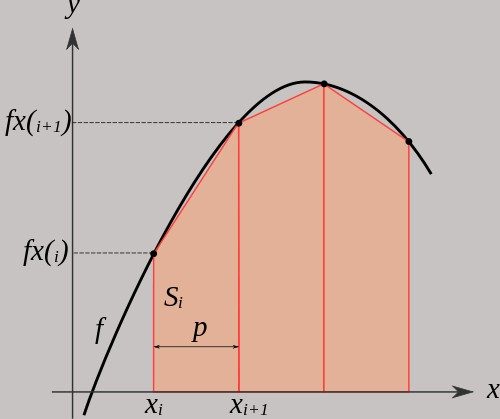

# Observing Scalability of the Trapezoidal Integration Example

In this practice activity, you will be trying an OpenMP parallel program that uses two patterns in particular:

- parallel loop with equal chunks
- reduction
  
These patterns are arguably the most prevalent in parallel programming, because they can often 'speed up' an original sequential program dramatically.

You have a couple of goals in this activity: 
1. Getting a feel for how this code runs, both a sequential version and a parallel version.
2. Learning to run experiments that try repeating tests cases multiple times and creating speedup curves and a graph for determining weak scalability.
   
## Relevant Reading

You will need some background study in scalability of parallel programs. This [chapter detailing scalability in parallel processing](https://tcpp.cs.gsu.edu/curriculum/?q=system/files/Ch04_0.pdf) provides the necessary background. Notice the definitions of strong and weak scalability.

## Race Conditions and Running Experiments

In this activity, you will practice using reduction to avoid race conditions, and you will run experiments to determine the scalability of this fairly simple parallelization.

### Trapezoidal Approximation

The code provided here integrates by computing the area under the curve of the integral of a function, f(x), using the trapezoidal rule. In particular, this code will use the trapezoid areas at points along the curve, like this:

This image was taken from [this explanation](https://chemicalstatistician.wordpress.com/2013/12/14/conceptual-foundations-and-illustrative-examples-of-trapezoidal-integration-in-r/), which you can refer to for more details.

To understand the code, it is useful to note that the integral approximation, which is the computation of sum of the areas of the trapezoids with constant interval width, can be converted to the following expansion:

 ∆x * 1/2 * (f(x_0) + f(x_1) + f(x_2) + ... + f(x_n-1) + f(x_n))

In the example code you are given, the variable *h* is the same as ∆x. We use this above summation, and we compute the integral from 0 to pi of sin(x), which we know should be 2.0. You could experiment with other known values of integrals of other functions if you wish to explore this and have time later.

### Further Reading

[Wikipedia page](https://en.wikipedia.org/wiki/Trapezoidal_rule) - see the section called 'non-uniform grid'.

[Demo describing the trapezoidal rule](http://www.math.umd.edu/~jmr/141/SimpsonDemo.html)

[Lots of detail from Khan Academy](https://www.khanacademy.org/math/calculus-home/integration-calc/trapezoidal-rule-calc/v/rectangular-and-trapezoidal-riemann-approximations)

### First examine the differences in the code and do some manual examination.

The first thing to do is to observe how this code runs manually. We should always do this before diving into our experiments.

For `trap-seq.c`, there are two places where there are two different ways of printing your output.

  - Look for a a comment saying "output for debugging". Uncomment these **two printfs** while you look at how the program is working and get a feel for how long certain problem sizes take. 
  - Look for the comment that starts with "output for sending to a spreadsheet". Comment this single printf line out for now.

After uncommenting and commenting, save the file over to the server and 'make' the sequential version.

For `trap-omp.c`, compare it side-by-side to the `trap-seq.c` code and find the places where openMP pragmas have been added and the way the code is timed has changed.

  - Look for the **two** debugging output printfs and uncomment them.
  - Look for the simpler printf line that prints the time followed by a tab. Comment it for now while you try the parallel version.

After uncommenting and commenting, save the file over to the server and 'make' the parallel version.

## Goal 1: Get a feel for the working code

You are provided with a working sequential implementation of this integration in `trap-seq.c`. On the server, run this to make only it, if you did not do this above when changing the file. Always make sure you have saved the code over to the mscs1 server.

    make trap-seq

Then try running it like this, giving it the number of trapezoids to use on the command line:

    ./trap-seq 4194304

Notice what gets printed. These should be fairly extensive print statements so that you can see what is happening This is from the uncommenting change you made earlier- you will need to change these back later. The important idea here is that we have used the function sine(x), which when integrated from 0 to &pi; should equal 2.0.

Next, when you create a parallel version, you can check its correctness by verifying that it is correct by checking that it returns very close to 2.0. (If you want to be clever, add an assert for this when you eliminate some of the prints as suggested below.)

# Note: you are given a working parallel version

The file `trap-omp.c` has already been updated to produce correct multi-threaded code. Concentrate on the second of these 2 lines for the pragma that splits up the for loop:

    #pragma omp parallel for default(none) \
    private(i) shared(n, a, h) reduction(+:integral)

The phrase `default(none)` says that all variables must be declared shared, private, or part of a reduction. If this is not there, then variables are defaulted to shared. It is good practice to use `default(none)` in these loop pattern situations because you can accidentally keep a variable shared that should be private if you miss it.

We have decided what variables should be shared among the threads, which should be private to each thread, and which need *reduction* due to being shared by all threads. To help you see why we have chosen these, recall the opnenMP patternlet example for reduction. Also, the rule of thumb for a shared variable is that it isn't being changed by any threads. If any forked threads that are doing part of the loop work are updating variables, then that variable will need to be private *or* in a reduction (**not both**).

By correctly setting the private and reduction variables, we are fixing the potential **race conditions*.

When you have examined the code and are familiar with it, `make` with the Makefile provided, if you did not earlier.

You run the parallel code like this, indicating the number of trapezoids and the number of threads to fork:

    ./trap-omp 4194304 2

You should see extensive prints if you had uncommented them correctly above.

## Observe timings manually

The code already has timing built into it. The `trap-seq` executable can take in varying values for the number of 'trapezoids' used in the computation. You run it like this:

    ./trap-seq 4194304
    
We refer to the number of trapezoids, which represent the work being done, as
the **problem size**. Try running it for a few problem sizes, using powers of 2 from 1048576 onwards.

Also try running your parallel version, `trap-omp`, varying the problem size, and using different numbers of threads. An interesting sequence to run to help you see the speedup of the code is this (be patient for the sequential one):

    ./trap-seq 268435455
    ./trap-omp 268435455 2
    ./trap-omp 268435455 4
    ./trap-omp 268435455 8
    ./trap-omp 268435455 16
    ./trap-omp 268435455 32

Note that 268435455 is a power of 2 and the number of threads is increasing by multiples of 2. this divides the problem evenly between the threads and demonstrates that adding twice as many threads cuts the time almost in half, but not quite, from the previous run. This is an indication of strong scalability.

**IMPORTANT**: not all problem sizes (number of trapezoids) will scale this nicely, nor will they do so all the way to 32 threads. You need to run further experiments using a range of problem sizes and a series of thread counts similar to what you just did for one problem size.

## Goal 2: Run experiments

Your next goal is to try some experiments to show how this program behaves in terms of scalability for various problem sizes. A convenient way to do this is to use linux shell scripting: we will take the commands that we normally type on the command line and use a program called a shell script to run them. The shell script can take arguments, like other program can.

The script can output data as tab-separated lines that can be written to a file. This way, you can import timings from many runs of your program into 

## Change the prints for experimental work with scripts

Change the printf lines back around from the changes that you made earlier, so that the "output for sending to a spreadsheet" is uncommented and the debugging two printf lines are commented.

**Be sure to do this to each of the two code files and save them.** Then run

    make

to rebuild them. If they each  compiled, then:

Try one of example of each, trap-seq and trap-omp, after making them to be sure that each seems to be printing only a run time, followed by a tab.

### Next run some preliminary experiments

There are 2 shell scripts prepared for you that help you run several tests.

1. One script, called `run_strong_tests.sh`, runs a series of problem sizes and numbers of threads. You indicate how many times you want repeat the experiment. Try it for 2 repetitions by doing this:

    bash ./run_strong_tests.sh 2

Note that the problem sizes vary from 1048576 to 67108864 and the number of threads used is 1, 2, 4, 6, 8, 12, 16. This script is designed to generate data for creating speedup curves to determine how strongly scalable a parallel solution is. Also note that this script **uses your trap-seq program for the sequential, or single thread case.** If possible, this is how we want to run our tests: compare the parallel performance to an original sequential version.

2. The second script, `run_weak_tests.sh`, is designed to determine whether a parallel solution is weakly scalable. (Sadly weakly scalable is a bad term, because many parallel programs have this property, and it is a good thing, because we can run bigger problems by using more threads and get results fast.) Try this script like this:

    bash ./run_weak_tests.sh 2 1048576 3

The above running of this script created data designed for an existing spreadsheet. The argument 2 is for the number of replications to run, and the number 1048576 is a starting problem size. The number 3 is the number of weak scalability lines to be graphed on the spreadsheet.

### Get your complete data

Now that you are familiar with the scripts, run the full experiments by trying 5 replicates and placing the output into a file, like this:

    bash ./run_strong_tests.sh 5 > trap_strong_out.tsv
    bash ./run_weak_tests.sh 5 1048576 3 > trap_weak_out.tsv

Note that you could try 10 tests if you wish, but it will take longer and you are likely doing this with other students doing the same thing. The spreadsheet will work whether you use 5 or 10 test replications.

Now be sure to sync your remote server files to your local machine, so that you have the .tsv files to import into your spreadsheet (next step).

### Get the spreadsheet and work inside Google Sheets

Make a copy of [this Google spreadsheet](
https://docs.google.com/spreadsheets/d/1g83euOuJMZaCZ6R-GzaJNPWQuTkyqTsazbol7o7Uitw/edit?usp=sharing) on your laptop.

This sheet has some example data in it, but you will need to replace it with yours.

1. Make a copy of the speedup spreadsheet in Google Drive, add it to your drive, and move it where it is best organized for you. From your copy of the spreadsheet, look at the sheet called “Raw Data From Strong Test Script”. It has a sample of what this data might look like.

2. Make a new spreadsheet tab called “My Raw Data From Strong Test Script”.

3. Pick this new blank sheet by clicking on its tab, then choose File-Import from the menu. Pick the tab on the right called Upload. Locate the trap_strong_out.tsv file and drag it or select it from your computer. Choose to place it in the current blank sheet and state that it is tab-separated.

4. Now you should have data that could be transferred to the first sheet, called Your results. You can copy the running times for each set of trials for a number of threads and all of the problem sizes into the place for them in Your Results tab, in the recorded execution times section on the *FAR* right (columns S - X). **NOTE:** these columns are not visible to you when you open the sheet- you must scroll over. Replace them with your data. You can use results from 5 tests or more, depending on what you ran; replace what is there.

**IMPORTANT:** the script created extra columns of data for trial and thread counts and a heading in row 1 that you will not copy over. There is also a thread count of 6 that does not have a place in the current spreadsheet. For the activity  you can skip that data- you might want to add it for the homework.

5. You can repeat steps 2-3 for weak scalability tests raw data import into a new sheet tab.

6. There is a small set of data copied over on the tab called Your results, way down at the bottom, at lines 67-71, column D. Note the rose-colored cells  just above that have instructions for where these were copied from your raw test results. Copy over more results. Note that the means are being computed and the graph begins to get filled in.

## Consider Speedup and Efficiency Results

For simple parallel programs like this one, it can be very useful to compute their speedup and efficiency. These are described in your textbook in Chapter 12, section 12.6, near figure 12.35. The spreadsheet helps you determine the values for speedup and efficiency of the parallel program at varying problem sizes.

Note that we will rarely, if ever, have ideal speedup and an efficiency of 1. However, if for a given problem size we can maintain a fairly high efficiency (say over 75%), we would consider the program to be **strongly scalable** *over the range of threads where this is the case*. We therefore often report a range of threads and a range of problem sizes for which our code exhibits strong scalability. 

**What range of problem sizes and threads produces an efficiency above 75%?**

**Given this data, what other experiments would you like to try to see under what other conditions does this program demonstrate strong scalability?**

## Weak Scalability

In weakly scalable cases, doubling the problem size while doubling the number of threads results in nearly the same times. We call this demonstrating **weak scalability**. This term is unfortunate, because many times in parallel computing this type of scalability is a good thing, and the best we will be able to do with certain types of problems.

Now look at the lower portion of the Your results spreadsheet, where your data should have been filled in and a graph of three lines created.

### Is it weakly scalable?

In the weak scalability graph, if the time remains constant as you double the problem size and double the number of threads, then the program demonstrates weak scalability.

**Do you get results that demonstrate weak scalability?** 
